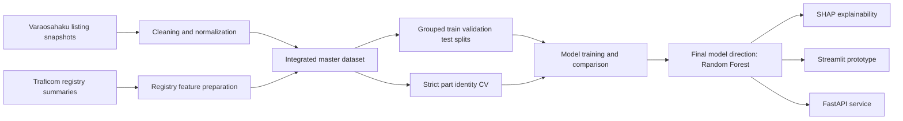

# DPPM

**Dismantler Price Prediction Model**

DPPM is an AMK/Bachelor thesis proof-of-concept for predicting used automotive spare-part listing prices from Varaosahaku.fi marketplace listings and Traficom-derived Finnish vehicle registry summary features.

The project is designed as a **decision-support tool for price review**. It is not an automated pricing authority or a definitive market-valuation system.

## Documentation

| Document | Purpose |
| --- | --- |
| [Architecture](docs/ARCHITECTURE.md) | System overview, data flow, components, and evaluation design. |
| [Roadmap](docs/ROADMAP.md) | Clear project phases, status, and remaining thesis work. |

## Project overview

The project addresses a practical pricing problem for dismantler spare-part listings. The workflow combines:

- repeated marketplace listing snapshots from **Varaosahaku.fi**
- Traficom-derived **brand-level and model-level registry summary features**
- cleaning, integration, and grouped evaluation designed to reduce leakage risk
- model comparison across linear, tree-based, and gradient-boosting approaches
- SHAP-based explainability for model-behavior interpretation
- Streamlit and FastAPI proof-of-concept interfaces

The goal is to estimate an expected listing price from available listing, vehicle, and registry-context information.

## Current status

| Area | Status | Notes |
| --- | --- | --- |
| Data collection | Done | Marketplace listing snapshots collected with the Playwright crawler. |
| Data preparation | Done | Cleaned master dataset and grouped splits are available. |
| Modeling | Done | Linear/Ridge, Random Forest, XGBoost, and CatBoost experiments completed. |
| Evaluation | Done | Fixed validation, product-id grouped CV, strict part-identity CV, and held-out grouped test results available. |
| Explainability | Mostly done | SHAP workflows and outputs exist for the main model paths. |
| Prototype | Mostly done | Streamlit and FastAPI proof-of-concept interfaces exist. |
| Thesis writing | In progress | Final writing, result presentation, and discussion polishing remain. |

## Data artifacts

| Artifact | Description |
| --- | --- |
| `datasets/cleaned/clean_master_dataset.csv` | Final cleaned modeling dataset with **11,321 rows**. |
| `datasets/splits/train_grouped.csv` | Grouped training split with **7,954 rows**. |
| `datasets/splits/validation_grouped.csv` | Grouped validation split with **1,689 rows**. |
| `datasets/splits/test_grouped.csv` | Grouped test split with **1,678 rows**. |

Repeated listing observations are intentionally preserved where useful for listing-history construction. The grouped split keeps all observations from the same `product_id` listing group in exactly one split.

## Model roles

| Role | Purpose |
| --- | --- |
| Operational/UI model | Context-rich listing-price model used in the demo interface. |
| Strict thesis model | Stricter Random Forest modeling path used for the main thesis result. |
| Robustness/conservative variant | Variant with selected listing-history/time features removed to test sensitivity. |

## Key results summary

The current final model direction is **Random Forest**. The main practical evaluation metric is **MAE**, because it is directly interpretable in euros.

### Fixed validation comparison

| Model | Feature set | Validation MAE | Validation RMSE | Validation R2 |
| --- | --- | ---: | ---: | ---: |
| Random Forest | Trusted recommended features without listing dates | **18.2409** | 48.6056 | 0.9927 |
| XGBoost | Trusted recommended features | 18.8845 | **44.5546** | **0.9938** |

### Product-id grouped CV comparison

| Model | Grouped CV MAE | Grouped CV RMSE | Grouped CV R2 |
| --- | ---: | ---: | ---: |
| Random Forest | **28.0424 +/- 4.7105** | 75.5137 | 0.9816 |
| XGBoost | 28.9228 +/- 7.3198 | **74.5482** | **0.9819** |

### Strict part-identity grouped CV comparison

| Model | Part-identity grouped CV MAE | RMSE | R2 | Median AE |
| --- | ---: | ---: | ---: | ---: |
| Random Forest, no `oem_number` | **34.4796 +/- 2.7151** | **70.3158** | **0.9864** | **12.3629** |
| XGBoost, no date offsets/no `oem_number` | 40.3583 +/- 4.4666 | 87.1192 | 0.9789 | 16.7802 |
| Linear Ridge, clean rerun | 53.6425 +/- 2.8193 | 152.9400 | 0.9343 | 16.5550 |
| CatBoost, clean rerun | 78.8475 +/- 11.3952 | 206.9250 | 0.8789 | 26.4075 |

The validation and grouped-CV results are strong, but the stricter part-identity evaluation gives the more conservative estimate for unseen comparable part identities. Under that stricter setting, Random Forest remains the strongest direction.

## Evaluation layers

| Layer | Approximate MAE | Purpose |
| --- | ---: | --- |
| Fixed validation split | 18 EUR | Optimistic model-selection estimate. |
| Product-id grouped CV | 28 EUR | Stability check across listing-group folds. |
| Strict part-identity grouped CV | 34 EUR | Conservative robustness estimate for unseen comparable part profiles. |
| Held-out grouped test | 22 EUR | Final check under the original product-id split design. |

For thesis interpretation, the strict part-identity result is the safest scientific claim. The grouped test result remains useful as the final held-out estimate under the original product-id split design.

## Architecture at a glance



See [docs/ARCHITECTURE.md](docs/ARCHITECTURE.md) for the full architecture view.

## Why the R2 values are high

The high R2 values should be interpreted carefully:

- Spare-part listing prices have strong **repeated-listing** and **comparable-item** structure.
- Taxonomy variables such as `subcategory`, `part_name`, and `category` explain a large amount of price variation because different spare-part types naturally occupy very different price ranges.
- Product-id grouping prevents the **same exact listing** from crossing train/validation/test boundaries.
- Highly similar part profiles can still exist under different `product_id` values.

For that reason, very high R2 should not be read as perfect general market-value prediction. It is better understood as strong predictive performance within a structured comparable-listing setting.

## SHAP explainability

SHAP is used here to explain **model behavior**, not to prove causal market relationships.

| Explanation type | Purpose |
| --- | --- |
| Global explanations | Show which features influence predictions most overall. |
| Local explanations | Show why one specific prediction is higher or lower. |
| Conservative SHAP variant | Tests interpretation stability when selected listing-history/time fields are removed. |

## Demo and prototype

The repository includes two proof-of-concept interfaces:

- **Streamlit prototype** for interactive decision-support use
- **FastAPI service** for API-style prediction

Both are intended for thesis demonstration and proof-of-concept evaluation, not as production-hardened deployment targets.

## Quickstart

```bash
python3 -m venv .venv
source .venv/bin/activate
pip install -r requirements.txt
playwright install firefox
streamlit run app/streamlit_app.py
```

FastAPI can be started with:

```bash
uvicorn app.fastapi_app:app --reload
```

## Repository structure

| Path | Purpose |
| --- | --- |
| `crawler/` | Playwright crawler for marketplace snapshots. |
| `notebooks/` | Preprocessing, integration, analysis, and training notebooks. |
| `datasets/` | Cleaned, merged, split, and registry-derived CSV data. |
| `scripts/` | Tuning, evaluation, export, and utility scripts. |
| `artifacts/` | Model artifacts, tuning outputs, and SHAP outputs. |
| `app/` | Streamlit and FastAPI proof-of-concept applications. |
| `src/` | Shared modeling and serving utilities. |
| `tests/` | Focused regression tests. |
| `docs/` | Architecture, roadmap, and project documentation. |

## Roadmap

| Phase | Status | Focus |
| --- | --- | --- |
| Phase 1: Data acquisition and preparation | Done | Crawler, cleaned dataset, registry features, grouped splits. |
| Phase 2: Modeling and evaluation | Done | Model comparison, grouped evaluation, final model direction. |
| Phase 3: Explainability and prototype | Mostly done | SHAP outputs, Streamlit demo, FastAPI demo, tests. |
| Phase 4: Thesis finalization | In progress | Results chapter, literature alignment, methodology tightening, discussion. |
| Phase 5: Presentation and handover | Planned | Demo script, final presentation material, repository consistency check. |

See [docs/ROADMAP.md](docs/ROADMAP.md) for the expanded roadmap.

## Development and cleanup notes

The repository intentionally preserves thesis evidence such as cleaned datasets, grouped split files, model-selection summaries, SHAP outputs, and evaluation artifacts. Do not delete these files as routine cleanup unless the thesis trail has been reviewed and the removal is documented.

Generated local files are ignored instead:

- Python caches: `__pycache__/`, `*.pyc`, `.pytest_cache/`
- local environments: `.venv/`, `.venv_catboost/`, `venv/`, `env/`
- Playwright/browser runtime files: `.playwright/`, `playwright/`, `node_modules/`, `playwright-report/`, `test-results/`
- local raw source data and generated deployment bundles that are too large or environment-specific for normal CI use

CI is intentionally lightweight. It installs `requirements.txt`, imports core modules, and runs `pytest`. It does not run crawler jobs, notebooks, model training, SHAP analysis, or artifact-generation scripts.

## Summary

DPPM is an applied thesis project that combines marketplace listing data and Traficom-derived registry context to estimate spare-part listing prices. The end-to-end workflow, cleaned datasets, grouped evaluation, model comparisons, explainability tooling, and prototype interfaces are already in place. The current final model direction is Random Forest, while the stricter part-identity evaluation provides the more conservative estimate for thesis interpretation.
