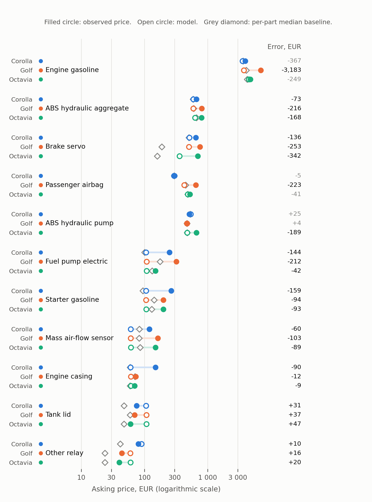
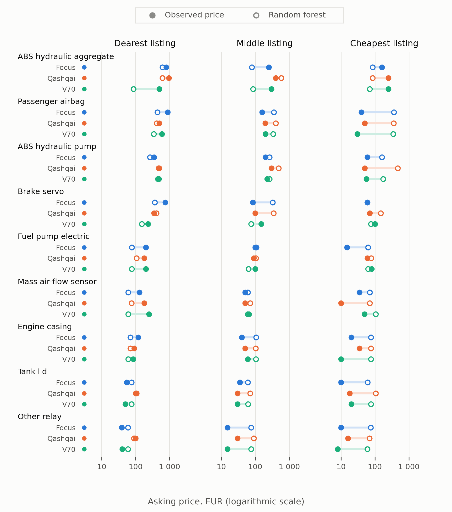

# DPPM: Dismantler Price Prediction Model

The frozen model scored, without refitting, on September 2026 listings. Top:
the Corolla, Golf and Octavia it was trained on. Bottom: the Focus, Qashqai and
V70 it never saw. Each row is one part on one vehicle, with the dearest, middle
and cheapest listing; filled dot is the real asking price, open dot the
prediction.

## About

DPPM predicts asking prices for used car spare parts on Varaosahaku.fi. A Random
Forest was trained on February 2026 listings for three vehicles, joined with
Finnish vehicle-registry (Traficom) summaries, and evaluated on a
connected-component split that keeps repeated and comparable listings on one
side of the split. On that test set it scores MAE 69.46 EUR, level with a simple
per-subcategory median lookup (66.15 EUR). The September study above checks it
against new listings: it is closest on the dearest listings and misses badly on
the cheap ones. Built as a proof of concept for price review, not for automated
pricing.

Everything else is in [docs/](docs/README.md).
