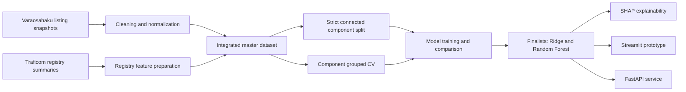

# DPPM

**Dismantler Price Prediction Model**

DPPM is an AMK/Bachelor thesis proof-of-concept for predicting used automotive spare-part listing prices from Varaosahaku.fi marketplace listings and Traficom-derived Finnish vehicle registry summary features.

The project is designed as a **decision-support tool for price review**. It is not an automated pricing authority or a definitive market-valuation system.

## Documentation

| Document | Purpose |
| --- | --- |
| [Architecture](docs/ARCHITECTURE.md) | System overview, data flow, components, and evaluation design. |
| [Roadmap](docs/THESIS_ROADMAP.md) | Clear project phases, status, and remaining thesis work. |
| [Strict model comparison](docs/STRICT_MODEL_COMPARISON.md) | Protocol, bias controls, and results of the strict-split model comparison. |

## Project overview

The project addresses a practical pricing problem for dismantler spare-part listings. The workflow combines:

- repeated marketplace listing snapshots from **Varaosahaku.fi**
- Traficom-derived **brand-level and model-level registry summary features**
- cleaning, integration, and grouped evaluation designed to reduce leakage risk
- model comparison across linear, tree-based, and gradient-boosting approaches
- SHAP-based explainability for model-behavior interpretation
- Streamlit and FastAPI proof-of-concept interfaces

The goal is to estimate an expected listing price from available listing, vehicle, and registry-context information.

## Current status

| Area | Status | Notes |
| --- | --- | --- |
| Data collection | Done | Marketplace listing snapshots collected with the Playwright crawler. |
| Data preparation | Done | Cleaned master dataset and grouped splits are available. |
| Modeling | Done | Linear/Ridge, Random Forest, XGBoost, and CatBoost experiments completed; strict stage-2 tuning finished and Random Forest won the strict MAE comparison. |
| Evaluation | Done | The final strict holdout ran once on 2026-07-10. The run-once guard is consumed and the numbers are final. |
| Explainability | Done for the frozen model | SHAP for the strict winner is in `artifacts/strict_final_shap/` (global, 500-1,000 EUR band, above-1,000 EUR tail). Dependence plots and a strict conservative-variant SHAP were **not** produced. Earlier `artifacts/*_shap*` outputs predate the strict protocol and explain a superseded model. |
| Prototype | Mostly done | Streamlit and FastAPI proof-of-concept interfaces exist. |
| Thesis writing | In progress | Final writing, result presentation, and discussion polishing remain. |

## Data artifacts

| Artifact | Description |
| --- | --- |
| `datasets/cleaned/clean_master_dataset.csv` | Final cleaned modeling dataset with **11,321 rows**. |
| `datasets/splits_strict/train_strict.csv` | Strict training split, **7,930 rows** - thesis-final protocol. |
| `datasets/splits_strict/validation_strict.csv` | Strict validation split, **1,695 rows**. |
| `datasets/splits_strict/test_strict.csv` | Strict test split, **1,696 rows** - **consumed 2026-07-10** by the single final evaluation. Do not score any further model on it. |
| `artifacts/strict_final_holdout/` | Final holdout metrics, predictions, and the trivial-baseline comparison. |
| `datasets/splits/*_grouped.csv` | Historical product-id grouped split (7,954 / 1,689 / 1,678 rows) - optimistic baseline only. |

The strict split keeps every connected component - rows linked by the same `product_id` or the same canonical part identity (`part_name + brand + model + year_start + year_end`) - in exactly one split (seed 32; provenance and leakage assertions in `datasets/splits_strict/strict_split_summary.json`). Repeated listing observations are intentionally preserved where useful for listing-history construction.

## Model roles

| Role | Purpose |
| --- | --- |
| Operational/UI model | Context-rich listing-price model used in the demo interface. |
| Strict thesis model | Strict Random Forest path selected under component-grouped cross-validation for the main thesis result. |
| Robustness/conservative variant | Variant with selected listing-history/time features removed to test sensitivity. |

## Key results summary

> **Headline finding.** On the untouched strict test split, the tuned Random Forest **ties a subcategory-median lookup table on MAE and loses to it on median absolute error**. Used spare-part asking prices in this marketplace are largely administered by subcategory convention; the model reproduces that convention and adds modest incremental value on higher-priced, less conventional listings. DPPM is a **market-consistency check**, not a pricing engine. Details: [final holdout](#final-strict-holdout-2026-07-10--run-once) and [docs/STRICT_MODEL_COMPARISON.md](docs/STRICT_MODEL_COMPARISON.md).

The strict thesis model is **Random Forest**. The pre-registered primary evaluation metric is **MAE**, because it is directly interpretable in euros — though see the caveat below on what that choice cost.

Thesis evidence comes from the **strict connected-component split** (`datasets/splits_strict/`). The earlier product-id grouped results are preserved as an optimistic historical baseline only, and the earlier OEM-based strict CV is superseded by the connected-component protocol (decision record in `docs/evaluation/`).

### Strict split model comparison (stage 1, 2026-07-07)

All four models with their known configurations were fit on `train_strict` and scored once on `validation_strict`. Full protocol and bias controls: [docs/STRICT_MODEL_COMPARISON.md](docs/STRICT_MODEL_COMPARISON.md).

| Model | Validation MAE | RMSE | R2 | Median AE |
| --- | ---: | ---: | ---: | ---: |
| Ridge (log target) | **92.05** | 247.57 | 0.847 | **15.89** |
| Random Forest | 92.93 | **239.15** | **0.858** | 23.51 |
| XGBoost | 106.91 | 281.80 | 0.802 | 27.09 |
| CatBoost | 168.82 | 527.97 | 0.306 | 33.15 |
| Dummy: subcategory median | 120.54 | 357.34 | - | 23.50 |
| Dummy: global median | 238.27 | 662.60 | - | 59.10 |

**Ridge and Random Forest** advance to strict-protocol tuning (full config search ranked by component-grouped CV); the winner is evaluated exactly once on the untouched strict test split.

### Historical baseline (original product-id split)

The original grouped split produced far lower errors (fixed validation about 18 EUR, grouped CV about 28 EUR, held-out grouped test about 22 EUR) because comparable part identities could still cross splits. The gap between those numbers and the strict results quantifies the comparable-part identity leakage. It is part of the thesis narrative, not evidence of final model performance.

### Strict stage-2 tuning comparison

| Model | Feature set | Strict CV MAE | Strict CV RMSE | Strict CV R2 | Strict CV Median AE |
| --- | --- | ---: | ---: | ---: | ---: |
| Ridge | Trusted recommended features without listing dates without OEM number | 106.7056 | 323.2321 | 0.6754 | 23.7836 |
| Random Forest | Trusted extended Traficom stack without OEM number | **105.3338** | **265.6255** | **0.7654** | 34.8453 |

Random Forest is the selected strict winner under the primary MAE criterion — by a margin of **1.38 EUR** against a fold standard deviation of 24-34 EUR. That margin is a coin flip on a tail-dominated metric, and Ridge was clearly better on median AE. The winner was frozen before the test split was touched and has not been revisited; see the limitations discussion in [docs/STRICT_MODEL_COMPARISON.md](docs/STRICT_MODEL_COMPARISON.md).

### Final strict holdout (2026-07-10) — run once

The frozen Random Forest was refit on `train_strict + validation_strict` (9,625 rows) and evaluated **exactly once** on the untouched `test_strict.csv` (1,696 rows). The run-once guard is now consumed. Artifacts: `artifacts/strict_final_holdout/`.

| Predictor | MAE (EUR) | Median AE (EUR) | RMSE (EUR) | R2 | MdAPE |
| --- | ---: | ---: | ---: | ---: | ---: |
| Random Forest (frozen winner) | 69.46 | 29.37 | **182.41** | **0.9113** | 29.74% |
| Dummy: subcategory median | **66.15** | **15.32** | 200.94 | 0.8924 | **16.43%** |
| Dummy: global median | 216.08 | 58.25 | - | - | 71.42% |

Bootstrap 95% CI for the model (B=10,000, seed 32): MAE [61.70, 77.96], median AE [27.85, 31.92], R2 [0.8871, 0.9310].

Paired bootstrap against the subcategory-median dummy on the same rows:

- **MAE: +3.31 EUR, CI [-2.88, +8.59]** - not significant. The model ties a lookup table.
- **Median AE: +14.04 EUR, CI [+11.51, +18.23]** - the model is significantly **worse** on the typical listing.
- The dummy is closer to the true price on **66.0%** of test rows.
- Segment-wise, the model's only significant win is the **500-1,000 EUR band** (67 rows, 4.0% of the split). It is significantly worse below 100 EUR and indistinguishable above 1,000 EUR, where both approaches fail badly (MAE 718.94 vs 679.61 EUR).

Listings above 1,000 EUR are 4.4% of the test split but carry **45.8%** of total absolute error; excluding them, model MAE falls to **39.41 EUR**.

**Scope of this negative result:** it shows that *this frozen Random Forest* does not beat the heuristic on typical listings. It does **not** show that no model can — in stage-2 cross-validation Ridge beat the same dummy by roughly 24% on MAE and 32% on median AE. Ridge was deliberately not scored on the holdout, because choosing it after seeing the Random Forest's result would be selection on the test set (`docs/DESIGN_DECISIONS.md`, 2026-07-10).

## Evaluation layers

| Layer | Status | Purpose |
| --- | --- | --- |
| Fixed validation split (product-id) | Historical | Optimistic development estimate. |
| Product-id grouped CV | Historical | Stability check across listing-group folds. |
| Held-out grouped test (product-id) | Historical | Final check under the original split design. |
| Strict split fixed validation | Done (stage 1) | Four-model comparison under the final protocol. |
| Strict component-grouped CV | Done (stage 2) | Candidate ranking for Ridge and Random Forest. Selection evidence only. |
| Strict untouched holdout | Done (2026-07-10, run once) | The final thesis claim. Guard consumed; not repeatable. |

For thesis interpretation, only the strict-protocol results are scientific evidence; the historical layers explain why the strict protocol exists.

## Architecture at a glance



See [docs/ARCHITECTURE.md](docs/ARCHITECTURE.md) for the full architecture view.

## Why the R2 values are high

**R2 is not a useful headline metric for this project, and the holdout proves it.** The model scores R2 = 0.9113 on the strict test split. A subcategory-median lookup table, which learns nothing, scores **0.8924** on the same rows. Almost all of the explained variance is the informativeness of a human-assigned category label, not learned structure. The model's predictions correlate with the dummy's at **0.9841**.

The model's genuine incremental contribution over that lookup is a **17.6% reduction in squared error** (RMSE 182.41 EUR vs 200.94 EUR), concentrated in higher-priced, less conventional listings. Real, but modest — and invisible if you only report R2.

The underlying reasons R2 runs high here:

- Taxonomy variables such as `subcategory`, `part_name`, and `category` explain a large amount of price variation, because different spare-part types occupy very different price ranges. This is the dominant effect.
- Spare-part listing prices have strong **repeated-listing** and **comparable-item** structure.
- The strict connected-component split removes comparable-part identity leakage; the historical product-id split did not, which is why its errors were roughly 5x lower.

For thesis reporting, lead with **median AE** and **segment-wise errors**, present MAE alongside, and state the dummy's score next to any R2 that appears. The target's median price is 100.60 EUR against a mean of 270.79 EUR, so mean-based metrics are dominated by a small expensive tail.

## SHAP explainability

SHAP is used here to explain **model behavior**, not to prove causal market relationships. It is descriptive, and it is never grounds to retune: the holdout is spent (`docs/DESIGN_DECISIONS.md`, 2026-07-10).

**Which SHAP is the thesis evidence.** Only `artifacts/strict_final_shap/` explains the frozen strict winner. It is produced by `scripts/run_strict_shap.py`, which refits the winner on train+validation exactly as the holdout did and explains the test rows. Earlier outputs — `artifacts/final_model_shap/`, `artifacts/final_model_shap_conservative/`, `artifacts/random_forest_shap/` — were generated in April 2026, before the strict connected-component split existed, and describe a different model (`trusted_recommended_features_without_oem_number` / `raw_half_features_leaf_1`). They are historical, like the grouped baseline, and are not thesis evidence.

### What SHAP found (2026-07-10)

Attribution over all 1,696 test rows, aggregated back to raw features:

| Feature group | Features | Share of attribution |
| --- | ---: | ---: |
| `part_taxonomy` | 3 | **80.67%** |
| `vehicle_age_usage` | 5 | 14.10% |
| `traficom_model_context` | 25 | 2.04% |
| `traficom_brand_context` | 24 | 1.77% |
| `vehicle_identity` | 2 | 1.24% |
| `part_condition` | 2 | 0.18% |

- **`subcategory` alone carries 66.55%.** This is the mechanism behind the holdout result: the model predicts the subcategory, which is why its predictions correlate with the subcategory-median lookup at 0.9841 and why it does not beat it.
- **The Traficom registry join did not pay for itself.** The 49 registry-derived features carry **3.81%** of attribution between them, and 37 of the 61 features contribute under 0.1% each. `mileage` ranks 7th at 0.73%.
- **Where the model wins, it wins on vehicle year.** In the 500-1,000 EUR band — its only significant win over the heuristic — `vehicle_age_usage` doubles to 28.76% while `part_taxonomy` falls to 58.86%.
- **Why it over-predicts the expensive tail.** Above 1,000 EUR, `part_taxonomy` pushes predictions +2,988 EUR off a base value of 271.17 EUR. The model places a listing in its subcategory and cannot discriminate within it.

Not produced: dependence plots, and a conservative-variant SHAP under the strict protocol.

## Demo and prototype

The repository includes two proof-of-concept interfaces:

- **Streamlit prototype** for interactive decision-support use
- **FastAPI service** for API-style prediction

Both are intended for thesis demonstration and proof-of-concept evaluation, not as production-hardened deployment targets.

## Quickstart

Requires **Python 3.12** (pinned in `.python-version`; `numpy==1.26.4` has no wheels on 3.13).
Dependencies are fully pinned in `requirements.txt`, so the frozen results are deterministic on a
clean install.

```bash
python3.12 -m venv .venv
source .venv/bin/activate
pip install -r requirements.txt
playwright install firefox
streamlit run app/streamlit_app.py
```

FastAPI can be started with:

```bash
uvicorn app.fastapi_app:app --reload
```

## Reproducibility

Confirm the frozen strict split still regenerates byte-identically and the holdout headline is
intact (regenerates into a temp dir; **modifies nothing frozen**; runs in seconds):

```bash
make verify        # or: python scripts/verify_reproducibility.py
```

`make help` lists the other entry points. The full run order, the list of **frozen** artifacts, and
what raw data is / is not shipped are documented in [docs/PIPELINE.md](docs/PIPELINE.md).

## Repository structure

| Path | Purpose |
| --- | --- |
| `crawler/` | Playwright crawler for marketplace snapshots. |
| `notebooks/` | Preprocessing, integration, analysis, and training notebooks. |
| `datasets/` | Cleaned, merged, split, and registry-derived CSV data. |
| `scripts/` | Tuning, evaluation, export, and utility scripts. |
| `artifacts/` | Model artifacts, tuning outputs, and SHAP outputs. |
| `app/` | Streamlit and FastAPI proof-of-concept applications. |
| `src/` | Shared modeling and serving utilities. |
| `tests/` | Focused regression tests. |
| `docs/` | Architecture, roadmap, and project documentation. |

## Roadmap

| Phase | Status | Focus |
| --- | --- | --- |
| Phase 1: Data acquisition and preparation | Done | Crawler, cleaned dataset, registry features, grouped splits. |
| Phase 2: Modeling and evaluation | Done | Model comparison, grouped evaluation, strict tuning winner selected, final strict holdout run once. |
| Phase 3: Explainability and prototype | Mostly done | SHAP for the frozen strict model done (2026-07-10); Streamlit demo, FastAPI demo, tests. Dependence plots outstanding. |
| Phase 4: Thesis finalization | In progress | Results chapter, literature alignment, methodology tightening, discussion. |
| Phase 5: Presentation and handover | Planned | Demo script, final presentation material, repository consistency check. |

See [docs/THESIS_ROADMAP.md](docs/THESIS_ROADMAP.md) for the expanded roadmap.

## Development and cleanup notes

The repository intentionally preserves thesis evidence such as cleaned datasets, grouped split files, model-selection summaries, SHAP outputs, and evaluation artifacts. Do not delete these files as routine cleanup unless the thesis trail has been reviewed and the removal is documented.

Generated local files are ignored instead:

- Python caches: `__pycache__/`, `*.pyc`, `.pytest_cache/`
- local environments: `.venv/`, `.venv_catboost/`, `venv/`, `env/`
- Playwright/browser runtime files: `.playwright/`, `playwright/`, `node_modules/`, `playwright-report/`, `test-results/`
- local raw source data and generated deployment bundles that are too large or environment-specific for normal CI use

CI is intentionally lightweight. It installs `requirements.txt`, imports core modules, and runs `pytest`. It does not run crawler jobs, notebooks, model training, SHAP analysis, or artifact-generation scripts.

## Summary

DPPM is an applied thesis project that combines marketplace listing data and Traficom-derived registry context to estimate spare-part listing prices. The end-to-end workflow, cleaned datasets, strict leakage-controlled evaluation, model comparisons, explainability tooling, and prototype interfaces are in place, and the final strict holdout has been run once.

Two results matter. **Methodologically**, comparable-part identity leakage inflated the original grouped-split numbers roughly fivefold; the connected-component protocol is the correction, and it is a contribution independent of any model's performance. **Substantively**, the tuned Random Forest ties a subcategory-median lookup on MAE and loses to it on median AE, which is evidence that used spare-part asking prices in this marketplace are administered by subcategory convention rather than discovered per listing. The model's incremental value is a 17.6% squared-error reduction concentrated in higher-priced, less conventional listings.

DPPM therefore supports **human-in-the-loop price review on high-value inventory** - flagging listings inconsistent with comparables - and does not support automated pricing. Above 1,000 EUR neither the model nor the heuristic is usable, and pricing must remain manual.
