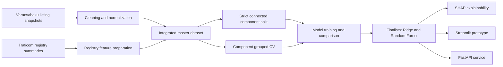

# DPPM

**Dismantler Price Prediction Model**

DPPM is an AMK/Bachelor thesis proof-of-concept for predicting used automotive spare-part listing prices from Varaosahaku.fi marketplace listings and Traficom-derived Finnish vehicle registry summary features.

The project is designed as a **decision-support tool for price review**. It is not an automated pricing authority or a definitive market-valuation system.

## Documentation

| Document | Purpose |
| --- | --- |
| [Architecture](docs/ARCHITECTURE.md) | System overview, data flow, components, and evaluation design. |
| [Roadmap](docs/THESIS_ROADMAP.md) | Clear project phases, status, and remaining thesis work. |
| [Strict model comparison](docs/STRICT_MODEL_COMPARISON.md) | Protocol, bias controls, and results of the strict-split model comparison. |

## Project overview

The project addresses a practical pricing problem for dismantler spare-part listings. The workflow combines:

- repeated marketplace listing snapshots from **Varaosahaku.fi**
- Traficom-derived **brand-level and model-level registry summary features**
- cleaning, integration, and grouped evaluation designed to reduce leakage risk
- model comparison across linear, tree-based, and gradient-boosting approaches
- SHAP-based explainability for model-behavior interpretation
- Streamlit and FastAPI proof-of-concept interfaces

The goal is to estimate an expected listing price from available listing, vehicle, and registry-context information.

## Current status

| Area | Status | Notes |
| --- | --- | --- |
| Data collection | Done | Marketplace listing snapshots collected with the Playwright crawler. |
| Data preparation | Done | Cleaned master dataset and grouped splits are available. |
| Modeling | Done | Linear/Ridge, Random Forest, XGBoost, and CatBoost experiments completed; strict stage-2 tuning finished and Random Forest won the strict MAE comparison. |
| Evaluation | In progress | Fixed validation, product-id grouped CV, strict part-identity CV, and held-out grouped test results are available; the final strict holdout is still pending. |
| Explainability | Mostly done | SHAP workflows and outputs exist for the main model paths. |
| Prototype | Mostly done | Streamlit and FastAPI proof-of-concept interfaces exist. |
| Thesis writing | In progress | Final writing, result presentation, and discussion polishing remain. |

## Data artifacts

| Artifact | Description |
| --- | --- |
| `datasets/cleaned/clean_master_dataset.csv` | Final cleaned modeling dataset with **11,321 rows**. |
| `datasets/splits_strict/train_strict.csv` | Strict training split, **7,930 rows** - thesis-final protocol. |
| `datasets/splits_strict/validation_strict.csv` | Strict validation split, **1,695 rows**. |
| `datasets/splits_strict/test_strict.csv` | Strict untouched test split, **1,696 rows** - reserved for one final evaluation. |
| `datasets/splits/*_grouped.csv` | Historical product-id grouped split (7,954 / 1,689 / 1,678 rows) - optimistic baseline only. |

The strict split keeps every connected component - rows linked by the same `product_id` or the same canonical part identity (`part_name + brand + model + year_start + year_end`) - in exactly one split (seed 32; provenance and leakage assertions in `datasets/splits_strict/strict_split_summary.json`). Repeated listing observations are intentionally preserved where useful for listing-history construction.

## Model roles

| Role | Purpose |
| --- | --- |
| Operational/UI model | Context-rich listing-price model used in the demo interface. |
| Strict thesis model | Strict Random Forest path selected under component-grouped cross-validation for the main thesis result. |
| Robustness/conservative variant | Variant with selected listing-history/time features removed to test sensitivity. |

## Key results summary

The current strict thesis model direction is **Random Forest**. The main practical evaluation metric is **MAE**, because it is directly interpretable in euros.

Thesis evidence comes from the **strict connected-component split** (`datasets/splits_strict/`). The earlier product-id grouped results are preserved as an optimistic historical baseline only, and the earlier OEM-based strict CV is superseded by the connected-component protocol (decision record in `docs/evaluation/`).

### Strict split model comparison (stage 1, 2026-07-07)

All four models with their known configurations were fit on `train_strict` and scored once on `validation_strict`. Full protocol and bias controls: [docs/STRICT_MODEL_COMPARISON.md](docs/STRICT_MODEL_COMPARISON.md).

| Model | Validation MAE | RMSE | R2 | Median AE |
| --- | ---: | ---: | ---: | ---: |
| Ridge (log target) | **92.05** | 247.57 | 0.847 | **15.89** |
| Random Forest | 92.93 | **239.15** | **0.858** | 23.51 |
| XGBoost | 106.91 | 281.80 | 0.802 | 27.09 |
| CatBoost | 168.82 | 527.97 | 0.306 | 33.15 |
| Dummy: subcategory median | 120.54 | 357.34 | - | 23.50 |
| Dummy: global median | 238.27 | 662.60 | - | 59.10 |

**Ridge and Random Forest** advance to strict-protocol tuning (full config search ranked by component-grouped CV); the winner is evaluated exactly once on the untouched strict test split.

### Historical baseline (original product-id split)

The original grouped split produced far lower errors (fixed validation about 18 EUR, grouped CV about 28 EUR, held-out grouped test about 22 EUR) because comparable part identities could still cross splits. The gap between those numbers and the strict results quantifies the comparable-part identity leakage. It is part of the thesis narrative, not evidence of final model performance.

### Strict stage-2 tuning comparison

| Model | Feature set | Strict CV MAE | Strict CV RMSE | Strict CV R2 | Strict CV Median AE |
| --- | --- | ---: | ---: | ---: | ---: |
| Ridge | Trusted recommended features without listing dates without OEM number | 106.7056 | 323.2321 | 0.6754 | 23.7836 |
| Random Forest | Trusted extended Traficom stack without OEM number | **105.3338** | **265.6255** | **0.7654** | 34.8453 |

Random Forest is the selected strict winner under the primary MAE criterion. The final strict holdout evaluation is still pending.

## Evaluation layers

| Layer | Status | Purpose |
| --- | --- | --- |
| Fixed validation split (product-id) | Historical | Optimistic development estimate. |
| Product-id grouped CV | Historical | Stability check across listing-group folds. |
| Held-out grouped test (product-id) | Historical | Final check under the original split design. |
| Strict split fixed validation | Done (stage 1) | Four-model comparison under the final protocol. |
| Strict component-grouped CV | Next (finalist tuning) | Candidate ranking for Ridge and Random Forest. |
| Strict untouched holdout | Pending (run once) | The final thesis claim. |

For thesis interpretation, only the strict-protocol results are scientific evidence; the historical layers explain why the strict protocol exists.

## Architecture at a glance



See [docs/ARCHITECTURE.md](docs/ARCHITECTURE.md) for the full architecture view.

## Why the R2 values are high

The high R2 values should be interpreted carefully:

- Spare-part listing prices have strong **repeated-listing** and **comparable-item** structure.
- Taxonomy variables such as `subcategory`, `part_name`, and `category` explain a large amount of price variation because different spare-part types naturally occupy very different price ranges.
- Product-id grouping prevents the **same exact listing** from crossing train/validation/test boundaries.
- Highly similar part profiles can still exist under different `product_id` values.

For that reason, very high R2 should not be read as perfect general market-value prediction. It is better understood as strong predictive performance within a structured comparable-listing setting.

## SHAP explainability

SHAP is used here to explain **model behavior**, not to prove causal market relationships.

| Explanation type | Purpose |
| --- | --- |
| Global explanations | Show which features influence predictions most overall. |
| Local explanations | Show why one specific prediction is higher or lower. |
| Conservative SHAP variant | Tests interpretation stability when selected listing-history/time fields are removed. |

## Demo and prototype

The repository includes two proof-of-concept interfaces:

- **Streamlit prototype** for interactive decision-support use
- **FastAPI service** for API-style prediction

Both are intended for thesis demonstration and proof-of-concept evaluation, not as production-hardened deployment targets.

## Quickstart

```bash
python3 -m venv .venv
source .venv/bin/activate
pip install -r requirements.txt
playwright install firefox
streamlit run app/streamlit_app.py
```

FastAPI can be started with:

```bash
uvicorn app.fastapi_app:app --reload
```

## Repository structure

| Path | Purpose |
| --- | --- |
| `crawler/` | Playwright crawler for marketplace snapshots. |
| `notebooks/` | Preprocessing, integration, analysis, and training notebooks. |
| `datasets/` | Cleaned, merged, split, and registry-derived CSV data. |
| `scripts/` | Tuning, evaluation, export, and utility scripts. |
| `artifacts/` | Model artifacts, tuning outputs, and SHAP outputs. |
| `app/` | Streamlit and FastAPI proof-of-concept applications. |
| `src/` | Shared modeling and serving utilities. |
| `tests/` | Focused regression tests. |
| `docs/` | Architecture, roadmap, and project documentation. |

## Roadmap

| Phase | Status | Focus |
| --- | --- | --- |
| Phase 1: Data acquisition and preparation | Done | Crawler, cleaned dataset, registry features, grouped splits. |
| Phase 2: Modeling and evaluation | Mostly done | Model comparison, grouped evaluation, strict tuning winner selected; final strict holdout remains. |
| Phase 3: Explainability and prototype | Mostly done | SHAP outputs, Streamlit demo, FastAPI demo, tests. |
| Phase 4: Thesis finalization | In progress | Results chapter, literature alignment, methodology tightening, discussion. |
| Phase 5: Presentation and handover | Planned | Demo script, final presentation material, repository consistency check. |

See [docs/THESIS_ROADMAP.md](docs/THESIS_ROADMAP.md) for the expanded roadmap.

## Development and cleanup notes

The repository intentionally preserves thesis evidence such as cleaned datasets, grouped split files, model-selection summaries, SHAP outputs, and evaluation artifacts. Do not delete these files as routine cleanup unless the thesis trail has been reviewed and the removal is documented.

Generated local files are ignored instead:

- Python caches: `__pycache__/`, `*.pyc`, `.pytest_cache/`
- local environments: `.venv/`, `.venv_catboost/`, `venv/`, `env/`
- Playwright/browser runtime files: `.playwright/`, `playwright/`, `node_modules/`, `playwright-report/`, `test-results/`
- local raw source data and generated deployment bundles that are too large or environment-specific for normal CI use

CI is intentionally lightweight. It installs `requirements.txt`, imports core modules, and runs `pytest`. It does not run crawler jobs, notebooks, model training, SHAP analysis, or artifact-generation scripts.

## Summary

DPPM is an applied thesis project that combines marketplace listing data and Traficom-derived registry context to estimate spare-part listing prices. The end-to-end workflow, cleaned datasets, grouped evaluation, model comparisons, explainability tooling, and prototype interfaces are already in place. The current strict thesis model direction is Random Forest, while the stricter part-identity evaluation provides the more conservative estimate for thesis interpretation. The final strict holdout is still pending.
