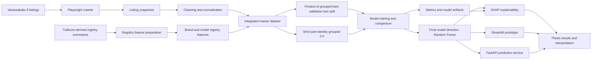
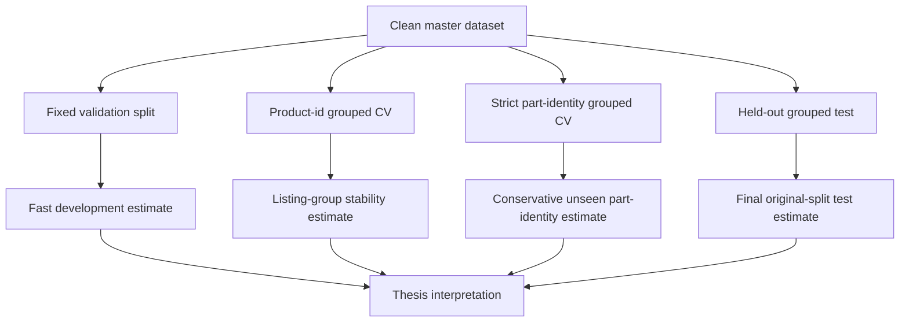
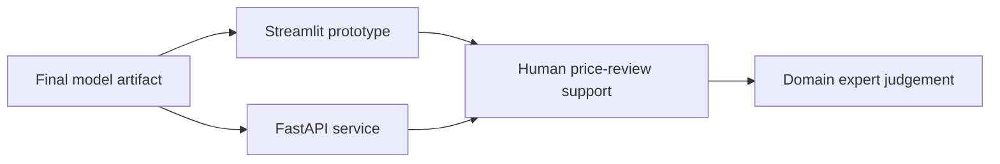

# Architecture

DPPM is a thesis proof-of-concept for estimating used automotive spare-part listing prices. The architecture is built around traceable data preparation, leakage-aware evaluation, model comparison, explainability, and lightweight demonstration interfaces.

The system is intentionally scoped as a research and decision-support prototype. It is not a production pricing engine.

## Data-flow overview

## Component map

| Component        | Location                                    | Responsibility                                                                                                      |
| ---------------- | ------------------------------------------- | ------------------------------------------------------------------------------------------------------------------- |
| Crawler          | `crawler/`                                  | Collect repeated marketplace listing snapshots.                                                                     |
| Data preparation | `notebooks/`, `scripts/`                    | Clean listings, integrate registry summaries, and create modeling-ready datasets.                                   |
| Datasets         | `datasets/`                                 | Store cleaned data, merged data, grouped splits, and registry-derived CSV files.                                    |
| Modeling         | `notebooks/`, `scripts/`, `src/`            | Train and compare Linear/Ridge, Random Forest, XGBoost, and CatBoost model paths.                                   |
| Evaluation       | `scripts/`, `artifacts/`                    | Run fixed validation, product-id grouped CV, strict part-identity grouped CV, and held-out grouped test evaluation. |
| Explainability   | `artifacts/` and analysis notebooks/scripts | Store and inspect SHAP global and local explanation outputs.                                                        |
| Prototype UI     | `app/streamlit_app.py`                      | Provide an interactive decision-support demonstration.                                                              |
| Prediction API   | `app/fastapi_app.py`                        | Provide an API-style proof-of-concept prediction interface.                                                         |
| Tests            | `tests/`                                    | Cover serving and UI helper logic with focused regression tests.                                                    |

## Evaluation architecture

DPPM uses several evaluation layers because used spare-part listings contain repeated observations and similar comparable items.

| Layer                           | Purpose                                                         | Interpretation                                                        |
| ------------------------------- | --------------------------------------------------------------- | --------------------------------------------------------------------- |
| Fixed validation split          | Supports quick model selection and comparison.                  | Optimistic development estimate.                                      |
| Product-id grouped CV           | Keeps repeated observations of the same listing group together. | Stability check across listing groups.                                |
| Strict part-identity grouped CV | Groups similar part identities together.                        | Conservative robustness estimate for unseen comparable part profiles. |
| Held-out grouped test           | Uses the untouched original product-id grouped test split.      | Final check under the original split design.                          |

For thesis claims, the strict part-identity grouped CV result should be treated as the safest scientific estimate. The held-out grouped test remains useful as a final check under the original split design.

## Prototype boundary

The prototype helps users inspect expected listing prices and model explanations. Final pricing decisions should remain with domain experts.

Before any production use, the project would need additional work around deployment hardening, monitoring, access control, model governance, data refresh processes, and business validation.

## Design principles

| Principle           | Meaning in this repository                                                                         |
| ------------------- | -------------------------------------------------------------------------------------------------- |
| Traceability        | Keep datasets, splits, metrics, and artifacts available for thesis evidence.                       |
| Leakage awareness   | Use grouped evaluation to reduce overly optimistic estimates from repeated listings.               |
| Interpretability    | Use SHAP to explain model behavior without presenting it as causal proof.                          |
| Prototype first     | Keep Streamlit and FastAPI lightweight for thesis demonstration rather than production deployment. |
| Conservative claims | Prefer stricter evaluation results when writing scientific conclusions.                            |

## Related documents

* [Project README](../README.md)
* [Thesis roadmap](THESIS_ROADMAP.md)
* [Strict evaluation protocol](STRICT_EVALUATION_PROTOCOL.md)
