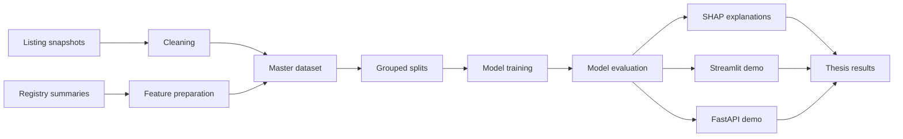

# DPPM Architecture

This page documents the project data flow, evaluation layers, and roadmap.

## Roadmap

| Phase | Status | Scope |
| --- | --- | --- |
| Phase 1: Data preparation | Done | Crawler, cleaned dataset, registry features, grouped splits. |
| Phase 2: Modeling | Done | Model comparison, grouped evaluation, final model selection. |
| Phase 3: Explainability and prototype | Mostly done | SHAP outputs, Streamlit demo, FastAPI demo, tests. |
| Phase 4: Thesis finalization | In progress | Results chapter, literature alignment, discussion, limitations. |
| Phase 5: Presentation and handover | Planned | Demo script, presentation material, final repository consistency check. |
