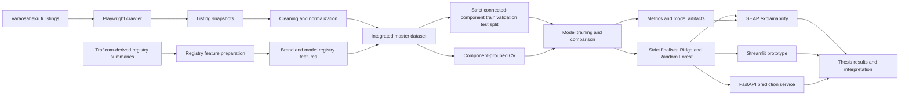
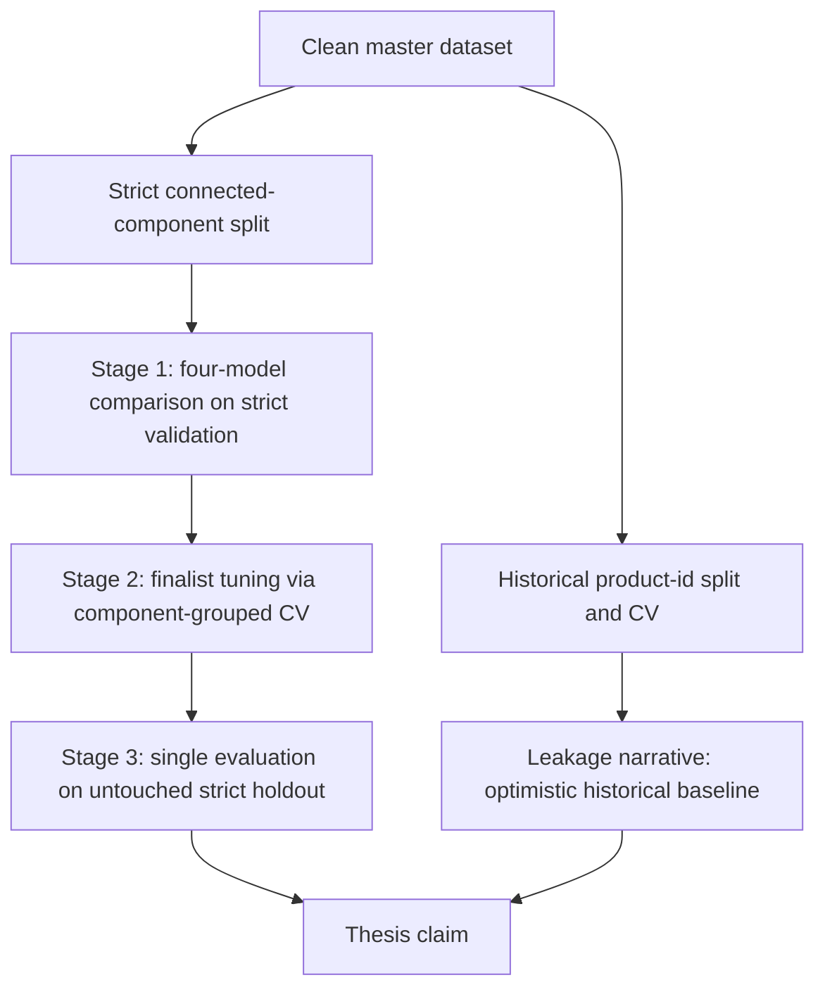
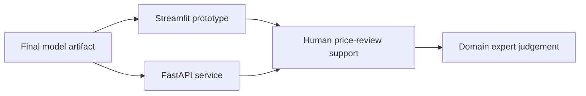

# Architecture

DPPM is a thesis proof-of-concept for estimating used automotive spare-part listing prices. The architecture is built around traceable data preparation, leakage-aware evaluation, model comparison, explainability, and lightweight demonstration interfaces.

The system is intentionally scoped as a research and decision-support prototype. It is not a production pricing engine.

## Data-flow overview

## Component map

| Component        | Location                                    | Responsibility                                                                                                      |
| ---------------- | ------------------------------------------- | ------------------------------------------------------------------------------------------------------------------- |
| Crawler          | `crawler/`                                  | Collect repeated marketplace listing snapshots.                                                                     |
| Data preparation | `notebooks/`, `scripts/`                    | Clean listings, integrate registry summaries, and create modeling-ready datasets.                                   |
| Datasets         | `datasets/`                                 | Store cleaned data, merged data, grouped splits, and registry-derived CSV files.                                    |
| Modeling         | `notebooks/`, `scripts/`, `src/`            | Train and compare Linear/Ridge, Random Forest, XGBoost, and CatBoost model paths.                                   |
| Evaluation       | `scripts/`, `src/`, `artifacts/`            | Historical product-id evaluations plus the strict connected-component protocol: model comparison, component-grouped CV tuning, and a single final holdout. |
| Explainability   | `artifacts/` and analysis notebooks/scripts | Store and inspect SHAP global and local explanation outputs.                                                        |
| Prototype UI     | `app/streamlit_app.py`                      | Provide an interactive decision-support demonstration.                                                              |
| Prediction API   | `app/fastapi_app.py`                        | Provide an API-style proof-of-concept prediction interface.                                                         |
| Tests            | `tests/`                                    | Cover serving and UI helper logic with focused regression tests.                                                    |

## Evaluation architecture

DPPM uses several evaluation layers because used spare-part listings contain repeated observations and similar comparable items.

| Layer                             | Purpose                                                                                   | Interpretation                                          |
| --------------------------------- | ----------------------------------------------------------------------------------------- | ------------------------------------------------------- |
| Historical product-id evaluations | Fixed validation, grouped CV, and grouped test under the original split.                  | Optimistic baseline; quantifies comparable-part leakage. |
| Strict split fixed validation     | Four-model comparison with known configurations (stage 1, done).                          | Selects the tuning finalists.                           |
| Strict component-grouped CV       | Ranks tuning candidates; folds grouped by the same connected-component rule as the split. | Selects the final model configuration.                  |
| Strict untouched holdout          | One guarded evaluation of the single winner, refit on train+validation. **Consumed 2026-07-10.** | The final thesis claim.                          |

For thesis claims, the strict connected-component protocol is the primary evidence. The historical product-id results explain why the strict protocol exists; the earlier OEM-based strict CV is superseded (see `docs/evaluation/`).

The holdout has been run. `datasets/splits_strict/test_strict.csv` is spent: no model may be scored on it again, and the guard in `notebooks/05_strict_training/03_strict_final_holdout.ipynb` enforces this. Trivial reference baselines were scored alongside the winner (`scripts/holdout_baseline_comparison.py`); candidate models were not. See `docs/DESIGN_DECISIONS.md` (2026-07-10) and `docs/STRICT_MODEL_COMPARISON.md` sections 8-10.

## Prototype boundary

The prototype helps users inspect expected listing prices and model explanations. Final pricing decisions should remain with domain experts.

Before any production use, the project would need additional work around deployment hardening, monitoring, access control, model governance, data refresh processes, and business validation.

## Design principles

| Principle           | Meaning in this repository                                                                         |
| ------------------- | -------------------------------------------------------------------------------------------------- |
| Traceability        | Keep datasets, splits, metrics, and artifacts available for thesis evidence.                       |
| Leakage awareness   | Use grouped evaluation to reduce overly optimistic estimates from repeated listings.               |
| Interpretability    | Use SHAP to explain model behavior without presenting it as causal proof.                          |
| Prototype first     | Keep Streamlit and FastAPI lightweight for thesis demonstration rather than production deployment. |
| Conservative claims | Prefer stricter evaluation results when writing scientific conclusions.                            |

## Related documents

* [Project README](../README.md)
* [Thesis roadmap](THESIS_ROADMAP.md)
* [Strict evaluation protocol](STRICT_EVALUATION_PROTOCOL.md)
